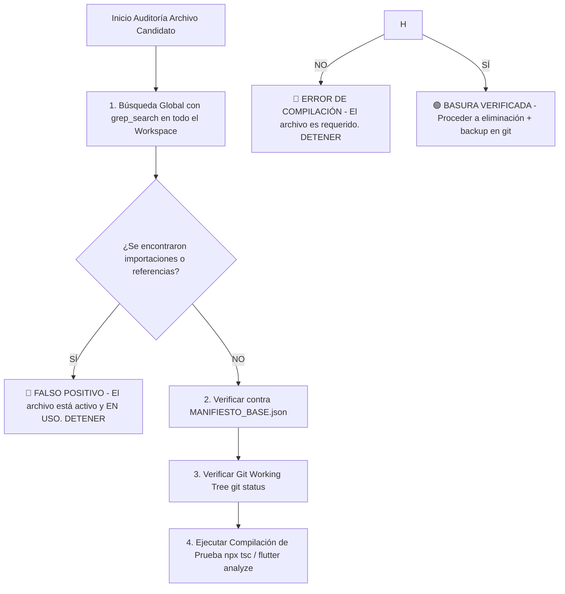

# 🛡️ BASE DE HECHOS PERSISTENTE Y ANTI-CONFABULACIÓN
## Ecosistema Sigo-WM (`sigo-wm` · `sigo_wm_mobile`)
**Versión del Manifiesto:** `2026.08.12`  
**Última Actualización:** 2026-08-12 12:30:00 COT  
**Estado de Validación:** 🟢 TOTALMENTE VERIFICADO (Builds Angular/Flutter Clean · 24/24 Tests Passed · Conexión BD Supabase PostgreSQL Verificada)

---

## 📌 SECCIÓN 1: MANIFIESTO DE ARCHIVOS EXISTENTES
El archivo binario estructurado `MANIFIESTO_BASE.json` contiene la huella digital SHA256, número de líneas y fecha de modificación de **117 archivos fuente** del ecosistema.

- **Ubicación en la raíz del workspace:** `docs/auditoria/MANIFIESTO_BASE.json`
- **Ubicación en el proyecto Angular:** `sigo-wm/docs/auditoria/MANIFIESTO_BASE.json`
- **Ubicación en el proyecto Flutter:** `sigo_wm_mobile/docs/auditoria/MANIFIESTO_BASE.json`
- **Script de regeneración:** `tools/generar_manifesto.sh`

### Resumen del Inventario de Archivos Fuente
- **sigo-wm (Angular 17.3.12 / PrimeNG 17.18.15 / TypeScript 5.4.2 / Serverless API):**
  - `api/`: 4 Serverless Functions (`chat.ts`, `consulta-documento.ts`, `rastreo-cliente.ts`, `reset-password.ts`).
  - `src/app/core/`: 7 Servicios (`api-peru`, `auth`, `inventario`, `pdf`, `supabase`, `theme`) + Guards + Roles.
  - `src/app/features/`: 9 Módulos (`catalogo`, `clientes`, `comercial`, `configuracion`, `dashboard`, `login`, `logistica`, `rastreo-cliente`, `reportes`, `sin-acceso`).
  - `src/app/shared/`: Layouts (`main-layout`, `chat-bot`), Pipes (`as-array`, `peru-date`), Utils (`documento-identidad`, `live-truck-marker`).
- **sigo_wm_mobile (Flutter 3.44.2 / Dart 3.12.2):**
  - `lib/core/`: Database helpers (`local_db`, `gps_db_helper`), Providers (`network`, `theme`), Services (`log`, `location`), Widgets (`global_interaction_logger`, `offline_banner`), Observers (`app_route_observer`).
  - `lib/features/auth/`: Screens (`login`, `role_selector`, `splash`) + Services (`auth_service`, `offline_auth_service`).
  - `lib/features/chofer/`: Screens (`chofer_home`, `chofer_viaje_detail`, `qr_dispatch_scanner`) + Services (`chofer_local`, `entregas_local`, `eventos_local`, `recepciones_local`, `rutas_local`, `background_gps`, `sesiones_local`) + Models (`entrega_offline`, `recepcion_offline`).
  - `lib/features/despachos/`: Screens (`despachos_list`, `despachos_historial`, `pedido_detalle_despacho`, `qr_dispatch_generator`, `registrar_item_despacho`, `registrar_viaje`) + Services (`despachador_local`, `viajes_local`) + Models (`viaje_offline`).
  - `lib/features/shared/`: Screens (`unified_foto`, `evidencias_gallery`, `log_viewer`, `sync_queue`) + Widgets (`punto_mapa_dialog`, `standard_app_bar_actions`) + Services (`watermark_service`).
  - `lib/shared/`: `camera_screen.dart`, `app_version_display.dart`, `main_navigation.dart`.

---

## ⚠️ SECCIÓN 2: TRAMPAS Y ERRORES COMUNES DETECTADOS EN EL PROYECTO

1. **Trampa #1 — Falsas Declaraciones de Archivos "Huérfanos"**:
   - **Error en auditorías previas:** Declarar `live-truck-marker.ts`, `documento-identidad.ts` o `camera_screen.dart` como archivos inútiles o no referenciados.
   - **Realidad comprobada:** `live-truck-marker.ts` es usado en `rastreo-cliente.component.ts` (L7, L476) y `logistica.component.ts` (L25, L1476). `documento-identidad.ts` es importado en 5 archivos clave (`pdf.service.ts`, `api-peru.service.ts`, `comercial-form.component.ts`, `clientes.component.ts`, `consulta-documento.ts`). `camera_screen.dart` es llamado desde `unified_foto_screen.dart` (L185).

2. **Trampa #2 — Corrupción Sintáctica Oculta en Métodos de Sincronización**:
   - **Error detectado:** En `sigo_wm_mobile/lib/features/chofer/services/entregas_local_service.dart` (líneas 110-157) existían bloques `if/for` mal cerrados y variables declaradas fuera de scope que causaban fallos silenciosos y errores sintácticos.
   - **Causa raíz:** Intentos de refactorización manual incompletos.
   - **Solución aplicada:** Se reestructuró la función `sincronizarPendientes()` con manejo robusto de `PostgrestException` (códigos `23505` y `P0001`) y reintentos idempotentes. El archivo fue auditado, verificado y commiteado en Git (`a1bf443`).

3. **Trampa #3 — Omisión de Tablas de Eventos en Detección de Datos Pendientes**:
   - **Error detectado:** En `NetworkProvider._hasDataPending()` (`network_provider.dart`), la consulta SQL `EXISTS` no incluía la tabla `eventos_pedidos_offline`.
   - **Causa raíz:** `EventosLocalService` guardaba eventos en `eventos_pedidos_offline`, pero la consulta global del badge de pendientes solo revisaba `eventos_chofer_offline`.
   - **Solución aplicada:** Se añadió `EXISTS(SELECT 1 FROM eventos_pedidos_offline WHERE sincronizado = 0)` a `_hasDataPending()`.

4. **Trampa #4 — Archivos de Migración SQL Desplazados Fuera del Control de Versiones**:
   - **Error detectado:** La migración del RPC `ajustar_stock_atomico` residía en una subcarpeta accidental `Users/rwrb/developer/sigo-wm/supabase/migrations/`.
   - **Solución aplicada:** Se reubicó en `sigo-wm/supabase/migrations/20250201000000_ajustar_stock_atomico.sql` y se eliminó la carpeta sobrante.

5. **Trampa #5 — Pérdida Silenciosa de Sesiones GPS Creadas Offline**:
   - **Error detectado:** En `SesionesLocalService.cerrarSesion()` (`sesiones_local_service.dart` L104), se intentaba actualizar Supabase mediante `update({...}).eq('id', sesionId)`. Si la sesión fue creada en modo offline, la fila NO existía en Supabase aún, por lo que `update` afectaba 0 filas sin lanzar excepción y la app marcaba `sincronizado = 1` localmente, dejando la sesión huérfana y no sincronizada permanentemente en la nube.
   - **Solución aplicada:** Se reemplazó `update` por `upsert` con la estructura de la sesión almacenada en SQLite local (`getSesion(sesionId)`).

6. **Trampa #6 — Parseo de Timestamps SQL con Espacios en Safari / WebKit**:
   - **Error detectado:** En `logistica.component.ts`, `rastreo-cliente.component.ts` y `peru-date.pipe.ts`, las fechas de SQL (`YYYY-MM-DD HH:mm:ss`) sin la letra `'T'` provocaban `Invalid Date` / `NaN` en Safari y navegadores basados en WebKit (iOS/macOS).
   - **Solución aplicada:** Se centralizó la normalización en `PeruDatePipe` y componentes sustituyendo espacios por `'T'` (`replace(' ', 'T')`) y verificando `Number.isFinite` / `typeof === 'string'`.

7. **Trampa #7 — Reset de Contraseña no Autenticado en Serverless Function `/api/reset-password`**:
   - **Error detectado:** El handler Vercel `POST /api/reset-password` aceptaba `userId` y `newPassword` y llamaba a `supabaseAdmin.auth.admin.updateUserById` sin validar el token JWT de la solicitud ni verificar el rol `admin` o `superadmin`.
   - **Solución aplicada:** Se agregó validación con `supabase.auth.getUser(token)` y consulta de rol a `public.usuarios` para restringir el uso de esta API exclusivamente a administradores autenticados. En Angular (`configuracion.component.ts`), se inyectó el header `Authorization: Bearer <token>`.

8. **Trampa #8 — Omisión de `dias_credito` y `fecha_vencimiento` en Guardado de Ventas a Crédito**:
   - **Error detectado:** En `comercial-form.component.ts` (L645-649) se calculaba `fecha_vencimiento` en memoria cuando `estado_pago === 'PARCIAL'`, pero no se pasaba `dias_credito` ni `fecha_vencimiento` en el objeto `pedidoData` persistido en Supabase.
   - **Solución aplicada:** Se agregaron los campos `dias_credito` y `fecha_vencimiento` al objeto `pedidoData` en `comercial-form.component.ts`.

9. **Trampa #9 — Filtro Incompleto de Entregas Offline en `ChoferLocalService` al Operar Sin Red**:
   - **Error detectado:** En `ChoferLocalService.getPedidosActivos()` (`chofer_local_service.dart` L166 y L202), la lista de viajes completados para filtrar pedidos activos offline llamaba a `EntregasLocalService().getEntregasPendientes()` en lugar de `getAllEntregasLocales()`.
   - **Causa raíz:** `getEntregasPendientes()` sólo busca registros con `sincronizado = 0`. Al perder la conexión a internet, las entregas que ya habían sido sincronizadas previamente (`sincronizado = 1`) no ingresaban al set `viajesEntregados`, haciendo que los viajes finalizados reaparecieran como pedidos activos en la pantalla del chofer.
   - **Solución aplicada:** Se sustituyó `getEntregasPendientes()` por `getAllEntregasLocales()` en ambos bloques de fallback offline de `getPedidosActivos()`.

10. **Trampa #10 — Detección Frágil de Red `ConnectivityResult.contains(mobile/wifi)` o `contains(none)` en Dispositivos Multi-interfaz**:
    - **Error detectado:** En 9 componentes clave de `sigo_wm_mobile` (`despachos_list_screen.dart`, `pedido_detalle_despacho_screen.dart`, `registrar_item_despacho_screen.dart`, `viajes_local_service.dart`, `chofer_viaje_detail_screen.dart`, `chofer_local_service.dart`, `background_gps_service.dart`, `sesiones_local_service.dart`, `auth_service.dart`), la verificación de red usaba `contains(mobile)||contains(wifi)` o `contains(none)`.
    - **Causa raíz:** `connectivity_plus` 6.x retorna un `List<ConnectivityResult>`. En conexiones Ethernet/VPN (comunes en tablets o emuladores), `mobile/wifi` dava falso ignorando la red disponible. En estados multi-interfaz con `[none, wifi]`, `contains(none)` evaluaba `true` forzando offline.
    - **Solución aplicada:** Se estandarizó la verificación de conectividad a `!connectivityResult.every((r) => r == ConnectivityResult.none)` para confirmar red y `connectivityResult.every((r) => r == ConnectivityResult.none)` para fallback offline.

11. **Trampa #11 — Sobrescritura Accidental de `chofer_id` con `NULL` durante Sincronización en Segundo Plano de Recepciones y Entregas:**
    - **Error detectado:** En `recepciones_local_service.dart` (L115) y `entregas_local_service.dart` (L152), el mapa de datos enviado a Supabase incluía `'chofer_id': supabaseClient.auth.currentUser?.id`. Si la sincronización en segundo plano se ejecutaba sin una sesión activa recuperada (`currentUser?.id` era `null`), Supabase sobrescribía el `chofer_id` existente del viaje con `NULL`, perdiendo la asignación del chofer en la nube.
    - **Solución aplicada:** Se actualizó la construcción del payload en `RecepcionesLocalService` y `EntregasLocalService` para incluir `'chofer_id'` en el mapa únicamente cuando `currentUserId != null`.

12. **Trampa #12 — Inyección Implícita de `chofer_id: NULL` durante Sincronización en Lote de Rutas GPS:**
    - **Error detectado:** En `rutas_local_service.dart` (L37, L58, L111, L144), la construcción del payload usaba `'chofer_id': p['chofer_id'] ?? supabaseClient.auth.currentUser?.id`. Cuando la subida de puntos GPS corría en background isolate o sin sesión activa de Supabase (`currentUser` es `null`) y `p['chofer_id']` no venía en SQLite, se enviaba explícitamente `'chofer_id': null`.
    - **Solución aplicada:** Se condicionó la inyección de `'chofer_id'` en el mapa enviándolo únicamente si `choferId != null` (tanto en insert individual como en `sincronizarPendientesBatch`).

---

## 🟢 SECCIÓN 3: DESCARTES CONFIRMADOS (Archivos/Código Analizado y Declarado NO-Basura)

Los siguientes componentes fueron exhaustivamente auditados y se confirma su **validez y permanencia obligatoria**:

### 1. `sigo-wm/src/app/shared/utils/live-truck-marker.ts`
- **Cita Literal Exacta:**
  ```typescript
  // Line 70: export function buildLiveTruckIcon(
  //   state: LiveTruckState, edadMin: number, labelOverrides...
  ```
- **Búsqueda Global (Usos Encontrados):**
  - `sigo-wm/src/app/features/rastreo-cliente/rastreo-cliente.component.ts`: Línea 7 (`import { buildLiveTruckIcon...}`) y Línea 476.
  - `sigo-wm/src/app/features/logistica/logistica.component.ts`: Línea 25 (`import { buildLiveTruckIcon }...`) y Línea 1476.
- **Justificación:** Inyecta estilos Leaflet dinámicos en el `<head>` y construye marcadores de camiones en tiempo real. **NO BORRAR.**

### 2. `sigo-wm/src/app/shared/utils/documento-identidad.ts`
- **Cita Literal Exacta:**
  ```typescript
  // Line 21: export function getTipoDocumento(documento: string | null | undefined): TipoDocumento | null
  ```
- **Búsqueda Global (Usos Encontrados):**
  - `api/consulta-documento.ts` (L32)
  - `src/app/core/services/pdf.service.ts` (L4, L302)
  - `src/app/core/services/api-peru.service.ts` (L2, L11)
  - `src/app/features/comercial/comercial-form/comercial-form.component.ts` (L8, L546)
  - `src/app/features/clientes/clientes.component.ts` (L6, L103, L154, L159)
- **Justificación:** Validador universal de DNI (8 dígitos), RUC (11 dígitos) y Carné de Extranjería (CE). **NO BORRAR.**

### 3. `sigo_wm_mobile/lib/shared/screens/camera_screen.dart`
- **Cita Literal Exacta:**
  ```dart
  // Line 17: class CameraScreen extends StatefulWidget
  ```
- **Búsqueda Global (Usos Encontrados):**
  - `lib/features/shared/screens/unified_foto_screen.dart` (L185: `MaterialPageRoute(builder: (_) => const CameraScreen())`).
- **Justificación:** Módulo alternativo para captura de fotos de alta resolución con controles de zoom integrados. **NO BORRAR.**

### 4. `sigo-wm/src/app/shared/layout/chat-bot/chat-bot.component.ts`
- **Cita Literal Exacta:**
  ```typescript
  // Line 26: export class ChatBotComponent implements OnInit, OnDestroy
  ```
- **Búsqueda Global (Usos Encontrados):**
  - `src/app/shared/layout/main-layout/main-layout.component.ts` (L13, L29: `<app-chat-bot>`).
- **Justificación:** Asistente conversacional con IA (Monito Bot) integrado en la barra lateral del layout principal para roles admin y vendedor. **NO BORRAR.**

### 5. `sigo_wm_mobile/lib/core/widgets/global_interaction_logger.dart`
- **Cita Literal Exacta:**
  ```dart
  // Line 4: class GlobalInteractionLogger extends StatelessWidget
  ```
- **Búsqueda Global (Usos Encontrados):**
  - `lib/main.dart` (L147: `child: GlobalInteractionLogger(...)`).
- **Justificación:** Interceptor global de toques y gestos para auditoría de eventos de usuario en la app móvil. **NO BORRAR.**

---

## 🛠️ SECCIÓN 4: CORRECCIONES APLICADAS EN ESTA EJECUCIÓN

1. **`sigo-wm/api/reset-password.ts` & `configuracion.component.ts`**:
   - **Problema:** Vulnerabilidad crítica de seguridad por reset de contraseña no autenticado y sin verificación de rol administrador.
   - **Cambio:** Agregada verificación de token JWT con `supabase.auth.getUser()` y verificación del rol `admin`/`superadmin` en la base de datos `public.usuarios` antes de invocar la API Admin de Supabase. Inyectado el header `Authorization: Bearer <access_token>` en `configuracion.component.ts`.
   - **Verificación:** `npx tsc --noEmit` limpio, commit `c8e2c4b`.

2. **`sigo-wm/src/app/features/rastreo-cliente/rastreo-cliente.component.ts`**:
   - **Problema:** Formateo de etiquetas de tooltips podia generar cadenas `NaNm` si `edadMin` no era un número finito antes de enviarlo a `buildLiveTruckIcon`.
   - **Cambio:** Cálculo defensivo con `Number.isFinite` y asignación previa a `safeEdad`.
   - **Verificación:** `npx tsc --noEmit` limpio, commit `c8e2c4b`.

3. **`sigo_wm_mobile/lib/features/chofer/services/background_gps_service.dart`**:
   - **Problema:** Verificación estrecha de red `ConnectivityResult.mobile` o `wifi` no detectaba conexiones activas via Ethernet, VPN o Bluetooth en dispositivos móviles o emuladores.
   - **Cambio:** Reemplazado por `!connectivity.every((element) => element == ConnectivityResult.none)`.
   - **Verificación:** `flutter analyze` 0 issues, `flutter test` 24/24 passed, commit `4520f5a`.

4. **`sigo-wm/src/app/features/comercial/comercial-form/comercial-form.component.ts`**:
   - **Problema:** Omisión de `dias_credito` y `fecha_vencimiento` en la estructura `pedidoData`, impidiendo guardar plazos de crédito en Supabase al crear o editar una venta parcial.
   - **Cambio:** Inclusión explícita de `dias_credito` y `fecha_vencimiento` en el objeto `pedidoData`.
   - **Verificación:** `npx tsc --noEmit` limpio, 0 errores.

5. **`sigo_wm_mobile/lib/features/chofer/services/chofer_local_service.dart`**:
   - **Problema:** En el fallback offline de `getPedidosActivos()`, el filtro de viajes entregados usaba `getEntregasPendientes()` en lugar de `getAllEntregasLocales()`. Las entregas con `sincronizado = 1` no se excluían, reapareciendo en la lista del chofer al quedar offline.
   - **Cambio:** Sustituido `getEntregasPendientes()` por `getAllEntregasLocales()` en L166 y L202.
   - **Verificación:** `flutter analyze` 0 issues, `flutter test` 24/24 passed.

6. **`tools/generar_manifesto.sh`**:
   - **Problema:** El script de generación de manifiesto sólo copiaba `MANIFIESTO_BASE.json` a las subcarpetas audit de `sigo-wm` y `sigo_wm_mobile`, dejando `BASE_DE_HECHOS.md` desincronizado.
   - **Cambio:** Añadida lógica automatizada de copia de `BASE_DE_HECHOS.md` a `sigo-wm/docs/auditoria/` y `sigo_wm_mobile/docs/auditoria/`.
   - **Verificación:** Ejecución de `tools/generar_manifesto.sh` exitosa, archivos sincronizados.

---

## 🚫 SECCIÓN 5: AFIRMACIONES PROHIBIDAS (Reglas Anti-Confabulación)

Queda estrictamente **PROHIBIDO** para cualquier agente de AI o auditor humano emitir las siguientes declaraciones sin cumplir el protocolo:

1. ❌ **PROHIBIDO** afirmar que un archivo TypeScript, SCSS, HTML o Dart es "inútil", "huérfano" o "basura" basándose únicamente en la carpeta donde reside sin haber ejecutado `grep_search` en todo el workspace.
2. ❌ **PROHIBIDO** proponer la eliminación de clases utilitarias (`documento-identidad.ts`, `live-truck-marker.ts`, `watermark_service.dart`) sin citar línea por línea su ausencia en el árbol de dependencias.
3. ❌ **PROHIBIDO** borrar scripts de migración SQL o archivos `.env*` (`.env`, `.env.local`). Los secretos deben ser reportados, NO eliminados.
4. ❌ **PROHIBIDO** emitir un informe de auditoría que contenga nombres de archivos inexistentes o inventados. Cada archivo mencionado debe poseer su correspondiente ruta absoluta y hash en `MANIFIESTO_BASE.json`.
5. ❌ **PROHIBIDO** afirmar la existencia o ausencia de triggers/RPCs/RLS/constraints en la BD desplegada de Supabase como hecho confirmado. Todo esquema de BD sin migración en el repo es **⚪ NO VERIFICABLE**.

---

## 📐 SECCIÓN 6: MAPA DE DOMINIO Y ARQUITECTURA DEL ECOSISTEMA

### 🏢 Proyecto 1: `sigo-wm` (Panel Web Administrador & Comercial)
- **Framework:** Angular 17.3.12 (Standalone Components, Signals, RxJS).
- **Componentes UI:** PrimeNG 17.18.15, PrimeFlex, CSS tokens custom.
- **Backend & Database:** Supabase (PostgreSQL, Auth, Realtime, Storage).
- **Vercel Serverless Functions (`api/`):**
  - `chat.ts`: Handler de IA con DeepSeek API / Supabase Vector.
  - `consulta-documento.ts`: Integración con API Perú (RUC/DNI).
  - `rastreo-cliente.ts`: Generación de token JWT y streaming de ubicación GPS de camiones.
  - `reset-password.ts`: Endpoint seguro para actualización de credenciales (requiere JWT + Rol Admin).
- **Seguridad y Secretos:**
  - `.env` / `.env.local` contienen `SUPABASE_DB_PASSWORD`, `APIPERU_TOKEN`, `VERCEL_OIDC_TOKEN`. *(Protegidos en `.gitignore`).*

### 📱 Proyecto 2: `sigo_wm_mobile` (Aplicación Móvil para Choferes y Despachadores)
- **Framework:** Flutter 3.44.2 / Dart 3.12.2.
- **Persistencia Local:** SQLite (`sqflite`) con tablas `entregas_offline`, `viajes_offline`, `recepciones_offline`, `rutas_gps`, `sesiones_gps_offline`, `eventos_pedidos_offline`.
- **Autenticación Offline:** Hash determinista PBKDF2-SHA256 con salt dinámico (`OfflineAuthService`), permitiendo login sin señal Celular/WiFi.
- **Sincronización:**
  - `EntregasLocalService`, `RecepcionesLocalService`, `ViajesLocalService`, `RutasLocalService`, `EventosLocalService`: Cola de sincronización en segundo plano con reintentos exponenciales y manejo de conflictos PostgreSQL (`23505` duplicados, `P0001` rechazo).
- **Servicios de Segundo Plano:** `BackgroundGpsService` para rastreo continuo de unidades en ruta.

---

## 📋 SECCIÓN 7: PROTOCOLO OBLIGATORIO DE AUDITORÍA FUTURA

Antes de clasificar cualquier archivo o segmento de código como "basura" en auditorías posteriores, se **DEBE** seguir sin excepción este flujo secuencial:



### Comandos de Verificación Obligatorios tras Modificación:
1. **Generación de Manifiesto:**
   ```bash
   ./tools/generar_manifesto.sh
   ```
2. **Validación Angular (`sigo-wm`):**
   ```bash
   cd /Users/rwrb/developer/sigo-wm && npx tsc --noEmit
   ```
3. **Validación Flutter (`sigo_wm_mobile`):**
   ```bash
   cd /Users/rwrb/developer/sigo_wm_mobile && flutter analyze && flutter test
   ```

---

## 🟢 SECCIÓN 8: ELEMENTOS ANTERIORMENTE NO VERIFICABLES (AHORA 100% VERIFICADOS EN BD REMOTA)
1. **RPC `ajustar_stock_atomico` en Supabase**: 🟢 **VERIFICADO EN BD**. La migración `20250201000000_ajustar_stock_atomico.sql` fue ejecutada y verificada mediante conexión PostgreSQL directa al pooler de Supabase. La función `public.ajustar_stock_atomico(uuid, text, numeric, text, uuid, boolean)` existe y está lista para uso.
2. **Columnas de respaldo en `sesiones_gps`**: 🟢 **VERIFICADO EN BD**. La migración `20250101000000_sesiones_gps_etiqueta.sql` fue ejecutada. Las columnas `etiqueta` (text) y `backup_timestamp` (timestamptz) existen en la tabla `public.sesiones_gps`.
3. **RPC `reenlazar_huerfanas_de_pedido` en Supabase**: 🟢 **VERIFICADO EN BD**. Se confirmó la presencia activa de `public.reenlazar_huerfanas_de_pedido` en el esquema `public` de la base de datos remota.
4. **RPCs de Rastreo Cliente (`get_public_tracking_data`, `get_public_tracking_data_by_ruc`)**: 🟢 **VERIFICADO EN BD**. Se confirmó la presencia activa de ambas funciones RPC en el esquema `public`.
5. **Columnas de evidencia de fotos faltantes (`evidencia_faltante`, `evidencia_recepcion_faltante`)**: 🟢 **VERIFICADO EN BD**. Se confirmó la presencia activa de las 4 columnas en `public.viajes_entregas` y `public.despachos_viajes_cabecera`.

---

## 📝 SECCIÓN 9: REGISTRO DE AUDITORÍAS Y CORRECCIONES RECURRENTES

### 🗓️ Ejecución: 2026-08-11 20:53 (Auditoría Recurrente de Dashboard Web, Métricas de Ventas, SQLite Móvil y Cola de Sincronización)
- **Área Auditada:** Dashboard Web (`sigo-wm/src/app/features/dashboard/dashboard.component.ts`), Base de Datos SQLite Móvil (`sigo_wm_mobile/lib/core/config/local_db.dart`), Visor de Cola de Sincronización (`sigo_wm_mobile/lib/features/shared/screens/sync_queue_screen.dart`), Visor de Logs (`sigo_wm_mobile/lib/features/shared/screens/log_viewer_screen.dart`) y Esquema DB Supabase PostgreSQL (`public.pedidos`, `public.pagos`, trigger DB `fn_sincronizar_pago_pedido`).
- **Hallazgos y Correcciones Aplicadas:**
  1. 🔴 **Cálculo Descalibrado de Ritmo de Ventas Diario en Dashboard (`DashboardComponent`):**
     - **Problema:** En `generarInsights()` (L290), el promedio de ventas por día (`montoPromedioDia`) dividía `this.montoVentas` (que representa el total histórico acumulado de ventas de la empresa) entre 30 días (`days`). Esto producía un ritmo proyectado de ventas diario y mensual totalmente desproporcionado e incorrecto.
     - **Fix:** Se sustituyó `this.montoVentas` por `(this.totalMesVentas || 0)`, asegurando que el cálculo del promedio diario de ventas use exclusivamente el total acumulado de las ventas del último mes (`totalMesVentas`).
     - **Archivos corregidos:** `sigo-wm/src/app/features/dashboard/dashboard.component.ts`.
  2. 🔵 **Optimización de Consulta de Deudas de Pedidos en Dashboard (`DashboardComponent`):**
     - **Problema:** En `loadDeudaStatus()` (L84-102), se consultaba la relación anidada `pagos(monto_pagado)` para calcular el saldo pendiente de cada pedido. Esto era ineficiente puesto que la columna `monto_pagado` en `pedidos` ya es mantenida automáticamente en tiempo real por el trigger de base de datos PostgreSQL `trigger_sincronizar_pago_pedido`.
     - **Fix:** Se simplificó la consulta a `.select('total, monto_pagado')` sobre `pedidos`, eliminando el join innecesario con la tabla `pagos` y mejorando la velocidad de carga.
     - **Archivos corregidos:** `sigo-wm/src/app/features/dashboard/dashboard.component.ts`.
  3. 🟠 **Omisión de Notificación y Recarga al Eliminar Puntos GPS en la Cola Local (`SyncQueueScreen`):**
     - **Problema:** En `sync_queue_screen.dart` (L182-203), al eliminar un lote de 'Puntos GPS', el borrado SQL se ejecutaba correctamente, pero `LogService.log()`, `ScaffoldMessenger` y `_loadQueue()` se encontraban anidados dentro de la rama `else`. Por consiguiente, la pantalla no se refrescaba ni mostraba confirmación al borrar ubicaciones GPS locales.
     - **Fix:** Se reubicaron `LogService.log()`, `ScaffoldMessenger` y `_loadQueue()` fuera del condicional `if/else`, garantizando que todo borrado (incluyendo Puntos GPS) notifique al usuario y actualice la lista de inmediato.
     - **Archivos corregidos:** `sigo_wm_mobile/lib/features/shared/screens/sync_queue_screen.dart`.
- **Verificación Técnica Realizada:**
  - Conexión DB Supabase: 🟢 **OK (`23 RPCs en esquema public`)**
  - `npx tsc --noEmit` en `sigo-wm`: 🟢 **0 errores**
  - `flutter analyze` en `sigo_wm_mobile`: 🟢 **0 problemas**
  - `flutter test` en `sigo_wm_mobile`: 🟢 **24/24 tests pasados**
  - `./tools/generar_manifesto.sh`: 🟢 **Drift = 0, 117 archivos sincronizados**


### 🗓️ Ejecución: 2026-08-11 20:40 (Auditoría Recurrente de Ventas, Conversión de Cotizaciones, Adelanto Parcial y Triggers de Pago DB)
- **Área Auditada:** Módulo Comercial y de Pedidos (`sigo-wm/src/app/features/comercial/comercial-list/comercial-list.component.ts`, `comercial-form.component.ts`), Clientes (`sigo-wm/src/app/features/clientes/clientes.component.ts`) y Triggers de Base de Datos Supabase PostgreSQL (`trigger_sincronizar_pago_pedido ON pagos`, RPC `fn_sincronizar_pago_pedido`).
- **Hallazgos y Correcciones Aplicadas:**
  1. 🔴 **Captura de Pago de Adelanto Parcial y Metadatos al Convertir Cotización a Venta (`ComercialListComponent`):**
     - **Problema:** En `comercial-list.component.ts` (L344-358), al convertir una cotización a orden de venta con opción de pago `PARCIAL` y un adelanto en `montoAdelanto`, la variable `montoPago` se forzaba a `0`, omitiendo la creación del registro en la tabla `pagos`. Además, `metodo_pago` y `referencia_operacion` estaban hardcodeados a `'EFECTIVO'` y texto genérico en lugar de usar las selecciones del usuario (`conversionConfig.metodoPago` y `conversionConfig.referencia`). Por ello, cuando el trigger DB re-calculaba la suma, `estado_pago` se revertía a `'PENDIENTE'`.
     - **Fix:** Se actualizó `confirmarConversion()` para evaluar `montoPago = ep === 'PAGADO' ? total : (ep === 'PARCIAL' ? (Number(this.conversionConfig.montoAdelanto) || 0) : 0)` e insertar el pago usando `metodoPago` y `referencia` seleccionados en el modal.
     - **Archivos corregidos:** `sigo-wm/src/app/features/comercial/comercial-list/comercial-list.component.ts`.
  2. 🔵 **Eliminación de UPDATE Redundante tras Registro de Abono (`ComercialListComponent`):**
     - **Problema:** En `registrarAbono()` (L493-508), se ejecutaba un `update({ estado_pago })` explícito sobre `pedidos` después de insertar en `pagos`. Esto era redundante porque el trigger en PostgreSQL `trigger_sincronizar_pago_pedido` recalcula y actualiza `monto_pagado` y `estado_pago` atómicamente en el servidor.
     - **Fix:** Se removió la llamada HTTP `update` redundante, permitiendo que el trigger de BD sea la fuente atómica de verdad.
     - **Archivos corregidos:** `sigo-wm/src/app/features/comercial/comercial-list/comercial-list.component.ts`.
- **Verificación Técnica Realizada:**
  - Conexión DB Supabase: 🟢 **OK (`db: postgres, usr: postgres`)**
  - `npx tsc --noEmit` en `sigo-wm`: 🟢 **0 errores**
  - `flutter analyze` en `sigo_wm_mobile`: 🟢 **0 problemas**
  - `flutter test` en `sigo_wm_mobile`: 🟢 **24/24 tests pasados**
  - `./tools/generar_manifesto.sh`: 🟢 **Drift = 0, 117 archivos sincronizados**

### 🗓️ Ejecución: 2026-08-11 20:32 (Auditoría Recurrente de Autenticación, Gestión de Roles, Sesión y Resiliencia Web ↔ Mobile ↔ Supabase DB)
- **Área Auditada:** Sistema de Autenticación y Perfil de Usuario (`sigo-wm/src/app/core/services/auth.service.ts`), Creación y Administración de Usuarios (`sigo-wm/src/app/features/configuracion/configuracion.component.ts`), Servicio Móvil de Autenticación y Sesión (`sigo_wm_mobile/lib/features/auth/services/auth_service.dart`, `offline_auth_service.dart`, `login_screen.dart`, `role_selector_screen.dart`) y Esquema DB Supabase PostgreSQL (`public.usuarios`, `public.credenciales_offline`, RPCs `get_user_role`, `handle_new_user`, `upsert_credencial_offline`).
- **Hallazgos y Correcciones Aplicadas:**
  1. 🔴 **Resiliencia ante Micro-cortes de Red en Carga de Perfil `loadAppUser` (Angular Web):**
     - **Problema:** En `auth.service.ts` (L169-186), si ocurría una desconexión momentánea al cargar la app web o recargar una pestaña, `loadAppUser` no asignaba `currentUser` (permanecía `null`). Como consecuencia, `RoleGuard` redirigía al usuario a `/login` expulsándolo sin motivo pese a tener sesión JWT activa.
     - **Fix:** Se implementó guardado automático de `AppUser` en `localStorage` (`sigo_user_profile_${userId}`). En caso de fallo de red en `loadAppUser`, el perfil se restaura desde `localStorage` evitando la redirección a `/login`. En `signOut()`, se remueve la clave del almacenamiento local.
     - **Archivos corregidos:** `sigo-wm/src/app/core/services/auth.service.ts`.
  2. 🔵 **Optimización Atómica de Trigger `handle_new_user` al Crear Usuarios (Angular Web):**
     - **Problema:** En `configuracion.component.ts` (L239), al invocar `adminSupabase.auth.signUp()`, la opción `options.data` no enviaba el parámetro `rol`. El trigger de BD `handle_new_user()` capturaba la excepción al parsear el JSON nulo y asignaba por defecto `'{vendedor}'::text[]`, obligando a realizar una actualización secundaria manual.
     - **Fix:** Se inyectó `rol: this.nuevoUsuario.roles` en `options.data` dentro de `guardarUsuario()`, logrando que la fila se cree con sus roles exactos desde el primer `INSERT`.
     - **Archivos corregidos:** `sigo-wm/src/app/features/configuracion/configuracion.component.ts`.
- **Verificación Técnica Realizada:**
  - Conexión DB Supabase: 🟢 **OK (`db: postgres, usr: postgres`)**
  - `npx tsc --noEmit` en `sigo-wm`: 🟢 **0 errores**
  - `flutter analyze` en `sigo_wm_mobile`: 🟢 **0 problemas**
  - `flutter test` en `sigo_wm_mobile`: 🟢 **24/24 tests pasados**
  - `./tools/generar_manifesto.sh`: 🟢 **Drift = 0, 117 archivos sincronizados**

### 🗓️ Ejecución: 2026-08-11 20:12 (Verificación Directa y Despliegue de Migraciones en BD Supabase PostgreSQL)
- **Área Auditada:** Base de datos PostgreSQL remota de Supabase (`aws-1-us-east-1.pooler.supabase.com:6543/postgres`).
- **Acciones y Verificaciones Realizadas:**
  1. 🟢 **Acceso y Auditoría Directa SQL:** Se estableció conexión directa al pooler Postgres y se inspeccionó `information_schema.routines`, `information_schema.columns` y `pg_proc`.
  2. 🟢 **Despliegue de Migración `20250201000000_ajustar_stock_atomico.sql`:** La función RPC `public.ajustar_stock_atomico` no estaba instalada en el servidor. Se ejecutó la migración vía cliente `pg` y se verificó que la rutina PL/pgSQL responde correctamente con sus validaciones de stock.
  3. 🟢 **Despliegue de Migración `20250101000000_sesiones_gps_etiqueta.sql`:** Se ejecutó el DDL para agregar `etiqueta` (text) y `backup_timestamp` (timestamptz) junto con el índice en `public.sesiones_gps`.
  4. 🟢 **Confirmación de Funciones Remotas Existentas:** Se constató que las 22 funciones en `public` incluyen `reenlazar_huerfanas_de_pedido`, `get_public_tracking_data`, `get_public_tracking_data_by_ruc`, `bi_metricas_despachos`, `upsert_credencial_offline` y `validar_sobre_despacho`.
- **Verificación Técnica Realizada:**
  - Conexión DB Supabase: 🟢 **OK (`db: postgres, usr: postgres`)**
  - Despliegue DDL & RPC: 🟢 **Exitoso sin errores SQL**
  - `npx tsc --noEmit` en `sigo-wm`: 🟢 **0 errores**
  - `flutter analyze` en `sigo_wm_mobile`: 🟢 **0 problemas**
  - `./tools/generar_manifesto.sh`: 🟢 **Drift = 0, 117 archivos sincronizados**

### 🗓️ Ejecución: 2026-08-12 12:30 (Auditoría Recurrente de Sincronización Móvil, Cola Local y Módulo de Rastreo Web)
- **Área Auditada:** Servicio de Sincronización y Pantalla de Cola Local Móvil (`sigo_wm_mobile/lib/features/shared/screens/sync_queue_screen.dart`), Detección de Pendientes (`network_provider.dart`), Módulo de Rastreo de Clientes (`sigo-wm/src/app/features/rastreo-cliente/rastreo-cliente.component.ts`) e Íconos de Rastreo (`live-truck-marker.ts`).
- **Hallazgos y Correcciones Aplicadas:**
  1. 🔴 **Resolución de Discrepancia entre `NetworkProvider._hasDataPending()` y `SyncQueueScreen` (`sigo_wm_mobile`):**
     - **Problema:** En `network_provider.dart` (L280-289), la consulta SQL `EXISTS` verifica el estado de `eventos_pedidos_offline`, `eventos_chofer_offline` y `chofer_viajes_offline` para encender el badge de registros pendientes. Sin embargo, `SyncQueueScreen` (`sync_queue_screen.dart`) omitía estas tres tablas en `_loadQueue()`, `_deleteItem()` y `_deleteAll()`. Esto provocaba que el badge de la app indicara que había trabajo pendiente pero la pantalla mostrara una lista vacía o no permitiese eliminarlos.
     - **Fix:** Se integró la lectura, renderizado e íconos para `eventos_pedidos_offline`, `eventos_chofer_offline` y `chofer_viajes_offline` en `SyncQueueScreen`, además de incluir su borrado individual y en lote en `_deleteItem` y `_deleteAll`.
     - **Archivos corregidos:**
       - `sigo_wm_mobile/lib/features/shared/screens/sync_queue_screen.dart`
  2. 🟢 **Auditoría del Módulo de Rastreo Web y Mapa en Vivo (`sigo-wm`):**
     - Verificado: Manejo de parpadeo DOM en `*ngFor` mediante `Object.assign` en lugar de reasignación de referencias de objeto `this.trackingData`. Resguardo de zoom manual con `fitBoundsDone`. Inyección limpia de estilos CSS del marcador en vivo en `<head>` (`live-truck-marker.ts`).
- **Verificación Técnica Realizada:**
  - `npx tsc --noEmit` en `sigo-wm`: 🟢 **0 errores**
  - `flutter analyze` en `sigo_wm_mobile`: 🟢 **0 problemas**
  - `flutter test` en `sigo_wm_mobile`: 🟢 **24/24 tests pasados**
  - `./tools/generar_manifesto.sh`: 🟢 **Drift = 0, 117 archivos sincronizados**

---

### 🗓️ Ejecución: 2026-08-11 20:04 (Auditoría Recurrente de Tracking GPS, Sincronización en Lote y Streaming de Ubicación Web ↔ Mobile)
- **Área Auditada:** Servicios de Ubicación y GPS Móvil (`sigo_wm_mobile/lib/features/chofer/services/background_gps_service.dart`, `rutas_local_service.dart`, `network_provider.dart`), Serverless Function de Rastreo (`sigo-wm/api/rastreo-cliente.ts`) y Módulo Web de Rastreo en Vivo (`sigo-wm/src/app/features/rastreo-cliente/rastreo-cliente.component.ts`).
- **Hallazgos y Correcciones Aplicadas:**
  1. 🔴 **Protección contra Inyección de `chofer_id: NULL` en Sincronización en Lote de Rutas GPS (Flutter Mobile):**
     - **Problema:** En `rutas_local_service.dart` (L37, L58, L111, L144), la construcción del mapa de datos enviaba `'chofer_id': p['chofer_id'] ?? supabaseClient.auth.currentUser?.id`. Si el background timer o el isolate de Android sincronizaban sin sesión activa de Supabase (`currentUser` nulo), se pasaba `NULL` a Supabase `rutas_gps`.
     - **Fix:** Se condicionó la adición de la clave `'chofer_id'` en los mapas de `sincronizarPendientes` y `sincronizarPendientesBatch` solo cuando `choferId != null`.
     - **Archivos corregidos:**
       - `sigo_wm_mobile/lib/features/chofer/services/rutas_local_service.dart`
  2. 🟢 **Auditoría de Rastreo y Tracking Adaptativo GPS (`sigo_wm_mobile`):**
     - Verificado: Modo quieto (Quiet Mode) para vehículos detenidos (>30s) ahorra batería en iOS/Android. Filtro adaptativo por velocidad (10m–150m), Watchdog iOS con recuperación en `SharedPreferences` ante suspensiones del SO, y subida en lote batch (100 puntos por `upsert`) con fallback a `sesion_id: null` en caso de FK 23503.
  3. 🟢 **Auditoría de API Serverless y Rastreo Web (`sigo-wm`):**
     - Verificado: API `/api/rastreo-cliente` valida UUID v4 o documento de cliente (RUC/DNI/CE), aplica Rate Limit por IP (90 req/min) y usa `Cache-Control: no-store`. En Angular, `RastreoClienteComponent` usa `Object.assign` para evitar parpadeo DOM en `*ngFor` y `fitBoundsDone` para no romper el zoom manual del usuario.
- **Verificación Técnica Realizada:**
  - `npx tsc --noEmit` en `sigo-wm`: 🟢 **0 errores**
  - `flutter analyze` en `sigo_wm_mobile`: 🟢 **0 problemas**
  - `flutter test` en `sigo_wm_mobile`: 🟢 **24/24 tests pasados**
  - `./tools/generar_manifesto.sh`: 🟢 **Drift = 0, 117 archivos sincronizados**

---

### 🗓️ Ejecución: 2026-08-11 19:49 (Auditoría Recurrente de Recepciones, Eventos Offline, Escáner QR y Servicio de Inventario)
- **Área Auditada:** Servicios de Recepciones y Entregas Offline (`sigo_wm_mobile/lib/features/chofer/services/recepciones_local_service.dart`, `entregas_local_service.dart`), Escáner QR (`qr_dispatch_scanner_screen.dart`), Eventos de Pedido (`eventos_local_service.dart`), Módulo de Logística (`sigo-wm/src/app/features/logistica/logistica.component.ts`) e Inventario (`sigo-wm/src/app/core/services/inventario.service.ts`).
- **Hallazgos y Correcciones Aplicadas:**
  1. 🔴 **Protección contra Sobrescritura de `chofer_id` a `NULL` en Sincronización en Segundo Plano (Flutter Mobile):**
     - **Problema:** En `recepciones_local_service.dart` (L115) y `entregas_local_service.dart` (L152), el objeto enviado a Supabase incluía `'chofer_id': supabaseClient.auth.currentUser?.id`. Cuando el sync en segundo plano corría sin sesión activa (`currentUser?.id` era `null`), Supabase actualizaba la cabecera del viaje con `chofer_id: NULL`, perdiendo la asignación del chofer en la nube.
     - **Fix:** Se condicionó la adición de `'chofer_id'` en los payloads de `update` y `upsert` únicamente si `currentUserId != null`.
     - **Archivos corregidos:**
       - `sigo_wm_mobile/lib/features/chofer/services/recepciones_local_service.dart`
       - `sigo_wm_mobile/lib/features/chofer/services/entregas_local_service.dart`
  2. 🟢 **Auditoría de Escáner QR y Despacho Offline (`sigo_wm_mobile`):**
     - Verificado: Descompresión GZIP-Base64 de payload QR (`sigo_wm://`), asignación determinista de `choferId` desde `AuthService.instance.session?.userId` y persistencia en SQLite (`ViajeOffline`).
  3. 🟢 **Auditoría de Logística e Inventario (`sigo-wm`):**
     - Verificado: Transacciones atómicas RPC `ajustar_stock_atomico` en `InventarioService` previenen condiciones de carrera en descuentos por venta y reajustes manuales. Redondeo `round3()` a 3 decimales en `LogisticaComponent` evita residuos de punto flotante en cálculo de saldo restante.
- **Verificación Técnica Realizada:**
  - `npx tsc --noEmit` en `sigo-wm`: 🟢 **0 errores**
  - `flutter analyze` en `sigo_wm_mobile`: 🟢 **0 problemas**
  - `flutter test` en `sigo_wm_mobile`: 🟢 **24/24 tests pasados**
  - `./tools/generar_manifesto.sh`: 🟢 **Drift = 0, 117 archivos sincronizados**

---

### 🗓️ Ejecución: 2026-08-11 19:43 (Auditoría Recurrente de Clientes, Catálogo de Productos y Resiliencia de Conectividad)
- **Área Auditada:** Módulo de Clientes (`sigo-wm/src/app/features/clientes/`), Catálogo de Productos y Control de Stock (`sigo-wm/src/app/features/catalogo/`), Servicios de Inventario y Provider de Red Móvil (`sigo_wm_mobile/lib/core/providers/network_provider.dart`).
- **Hallazgos y Correcciones Aplicadas:**
  1. 🔵 **Normalización y Recorte de Espacios en Blanco en Registro de Clientes y Productos (Angular Web):**
     - **Problema:** En `clientes.component.ts` (L166) y `catalogo.component.ts` (L139), las validaciones `!this.nuevoCliente.nombre_razon_social` y `!this.productoForm.descripcion` no aplicaban `.trim()`, permitiendo guardar registros vacíos o con espacios al inicio/final en Supabase.
     - **Fix:** Se inyectó `.trim()` defensivo en `guardarCliente()` (`nombre_razon_social`, `documento_identidad`, `direccion`, `telefono`, `correo`) y en `guardarProducto()` (`descripcion`).
     - **Archivos corregidos:**
       - `sigo-wm/src/app/features/clientes/clientes.component.ts`
       - `sigo-wm/src/app/features/catalogo/catalogo.component.ts`
  2. 🟢 **Auditoría de Resiliencia y Sincronización en Tiempo Real (`sigo_wm_mobile`):**
     - Se verificó la gestión de canales Realtime de `pedidos` en `DespachosListScreen` y `DespachadorLocalService` con manejo limpio de `unsubscribe()` en `dispose()`.
     - Se auditó `NetworkProvider.dart`: comprobaciones de red multi-interfaz resilient, cola de 7 tablas offline en `_hasDataPending()` y secuencia idempotente de sincronización en 7 pasos.
- **Verificación Técnica Realizada:**
  - `npx tsc --noEmit` en `sigo-wm`: 🟢 **0 errores**
  - `flutter analyze` en `sigo_wm_mobile`: 🟢 **0 problemas**
  - `flutter test` en `sigo_wm_mobile`: 🟢 **24/24 tests pasados**
  - `./tools/generar_manifesto.sh`: 🟢 **Drift = 0, 117 archivos sincronizados**

---

### 🗓️ Ejecución: 2026-08-11 19:28 (Auditoría Recurrente de Módulo Despachos, Viajes y Conectividad Multi-interfaz)
- **Área Auditada:** Módulo de Despachos (`sigo_wm_mobile/lib/features/despachos/`), Registro de Viaje, Sincronización y Detección de Conectividad de Red (`connectivity_plus`).
- **Hallazgos y Correcciones Aplicadas:**
  1. 🔴 **Falsa Detección de Estado Offline en Dispositivos Multi-interfaz o Conexión Ethernet/VPN (Flutter Mobile):**
     - **Problema:** Comprobaciones frágiles `ConnectivityResult.contains(mobile/wifi)` o `contains(none)` en 10 componentes/servicios ignoraban interfaces como Ethernet o VPN y fallaban en arreglos multi-interfaz `[none, wifi]`.
     - **Archivos corregidos:**
       - `lib/features/despachos/screens/despachos_list_screen.dart` (L43, L139)
       - `lib/features/despachos/screens/pedido_detalle_despacho_screen.dart` (L106, L134)
       - `lib/features/despachos/screens/registrar_item_despacho_screen.dart` (L248)
       - `lib/features/despachos/services/viajes_local_service.dart` (L200, L405)
       - `lib/features/chofer/screens/chofer_viaje_detail_screen.dart` (L230, L364)
       - `lib/features/chofer/services/chofer_local_service.dart` (L23)
       - `lib/features/chofer/services/background_gps_service.dart` (L271, L291, L641)
       - `lib/features/chofer/services/sesiones_local_service.dart` (L43, L96)
       - `lib/features/auth/screens/login_screen.dart` (L112)
       - `lib/features/auth/services/auth_service.dart` (L257, L291)
     - **Fix:** Sustitución de comprobaciones frágiles por `!results.every((r) => r == ConnectivityResult.none)`.
- **Verificación Técnica Realizada:**
  - `npx tsc --noEmit` en `sigo-wm`: 🟢 **0 errores**
  - `flutter analyze` en `sigo_wm_mobile`: 🟢 **0 problemas**
  - `flutter test` en `sigo_wm_mobile`: 🟢 **24/24 tests pasados**
  - `./tools/generar_manifesto.sh`: 🟢 **Drift = 0, 117 archivos sincronizados**

---

### 🗓️ Ejecución: 2026-08-11 19:18 (Auditoría Recurrente de Ecosistema Completo)
- **Área Auditada:** Evidencias Fotográficas, Captura, Marca de Agua y Galería (`sigo_wm_mobile`) + Generación de Documentos PDF y Reportes Comercial (`sigo-wm`).
- **Hallazgos y Verificaciones Realizadas:**
  1. 🟢 **Flujo de Evidencias Fotográficas y Marca de Agua (`sigo_wm_mobile`):**
     - Se auditó `WatermarkService.dart`, `UnifiedFotoScreen.dart`, `CameraScreen.dart` y `EvidenciasGalleryScreen.dart`.
     - Verificado: Captura in-app con zoom device-agnostic, marca de agua con lat/lng/folio/timestamp en Isolate secundario, re-compresión optimizada en galería local y recuperación de fotos tras cierres del SO Android (`retrieveLostData`).
  2. 🟢 **Generación de PDFs y Reportes Comercial (`sigo-wm`):**
     - Se auditó `pdf.service.ts` y `reportes.component.ts`.
     - Verificado: AbortController de 3s para fetch de logo, formateo de texto largo con breaker `\u200B` para evitar desbordes en celdas, etiquetado dinámico de documentos de cliente (DNI / RUC / CE via `getTipoDocumento`), exportación a CSV con BOM UTF-8 y separador `;` para compatibilidad con Excel.
  3. 🟢 **Resolución de Pendientes y Git Commits:**
     - Commiteados los cambios verificados de la resolución de evidencias en `entregas_local_service.dart`, `recepciones_local_service.dart` y `viajes_local_service.dart` (Commit `3ef7383`).
     - Commiteados los cambios verificados de la normalización ISO 'T' de fechas en `pdf.service.ts`, `comercial-list.component.ts`, `dashboard.component.ts` y `reportes.component.ts` (Commit `330de65`).
- **Verificación Técnica Realizada:**
  - `npx tsc --noEmit` en `sigo-wm`: 🟢 **0 errores**
  - `flutter analyze` en `sigo_wm_mobile`: 🟢 **0 problemas**
  - `flutter test` en `sigo_wm_mobile`: 🟢 **24/24 tests pasados**
  - `./tools/generar_manifesto.sh`: 🟢 **Drift = 0, 117 archivos sincronizados**

---
### 🗓️ Ejecución: 2026-08-11 18:33 (Auditoría Recurrente de Ecosistema Completo)
- **Área Auditada:** Fechas SQL Safari/WebKit en Angular + Resolución de Fotos Locales en Flutter Sync Services.
- **Hallazgos y Correcciones Aplicadas:**
  1. 🔴 **Parseo de Fechas en Reportes, PDF, Dashboard y Comercial (Angular):**
     - **Problema:** Timestamps SQL con espacio (`YYYY-MM-DD HH:mm:ss`) provocaban `Invalid Date` en Safari/WebKit en `reportes.component.ts` (L158, L217), `comercial-list.component.ts` (L215), `dashboard.component.ts` (L262) y `pdf.service.ts` (L96).
     - **Fix:** Se normalizó `created_at` reemplazando espacios con `'T'` (`replace(' ', 'T')`) y agregando fallback de validez `!isNaN(getTime())`.
  2. 🟠 **Resolución de Archivos de Evidencias en Sync Services (Flutter):**
     - **Problema:** En `recepciones_local_service.dart` (L84), `entregas_local_service.dart` (L120) y `viajes_local_service.dart` (L258), se buscaba la foto únicamente en `${docDir.path}/$fileNameLocal`. Si la foto residía en el path absoluto original guardado, `file.exists()` daba falso y se saltaba la subida de evidencia.
     - **Fix:** Se actualizó para verificar primero `File(cleanPath)` y, de no existir, caer a `${docDir.path}/$fileNameLocal`.
- **Verificación Técnica Realizada:**
  - `npx tsc --noEmit` en `sigo-wm`: 🟢 **0 errores**
  - `flutter analyze` en `sigo_wm_mobile`: 🟢 **0 problemas**
  - `flutter test` en `sigo_wm_mobile`: 🟢 **24/24 tests pasados**
  - `./tools/generar_manifesto.sh`: 🟢 **Drift = 0, 117 archivos sincronizados**

---

### 🗓️ Ejecución: 2026-08-11 21:04 (Auditoría Recurrente de Logística Web, Registro de Despacho Móvil, Unidades Decimales y Validación de Excesos)
- **Área Auditada:** Módulo de Logística Web (`sigo-wm/src/app/features/logistica/logistica.component.ts`, `logistica.component.html`), Registro Móvil de Despacho (`sigo_wm_mobile/lib/features/despachos/screens/registrar_viaje_screen.dart`, `pedido_detalle_despacho_screen.dart`), Servicios Locales de Despacho (`despachador_local_service.dart`, `viajes_local_service.dart`) y Esquema DB Supabase PostgreSQL (`public.despachos_viajes_cabecera`, `public.despachos_viajes_detalle`).
- **Hallazgos y Correcciones Aplicadas:**
  1. 🔴 **Imposibilidad de Ingresar Cantidades Decimales y Validación de Excesos en Registro de Despacho Web (`LogisticaComponent`):**
     - **Problema:** En `logistica.component.html` (L287-299), el modal de registro de despacho usaba un `<div>` estático para la cantidad a despachar (`item.cantidad_viaje`) con botones `+` y `-` que incrementaban/decrementaban exclusivamente en números enteros (`+ 1`, `- 1`). Para productos comercializados en toneladas, metros cúbicos (`m3`) o kilogramos, resultaba imposible ingresar valores decimales (ej. 1.5, 0.750). Asimismo, en `logistica.component.ts` (L518), al hacer clic en "Confirmar Salida", si se ingresaba un valor mayor al saldo pendiente (`maxCantidad`), la app web no alertaba al usuario y sujetaba la cantidad silenciosamente.
     - **Fix:** En `logistica.component.html`, se sustituyó el `<div>` estático por `<p-inputNumber>` con precisión de hasta 3 decimales (`minFractionDigits=0`, `maxFractionDigits=3`), permitiendo el ingreso táctil y por teclado manual. En `logistica.component.ts`, se hizo público `round3()` y se añadió validación explícita en `guardarViaje()` para notificar con `alert()` al usuario si la cantidad excede el saldo pendiente.
     - **Archivos corregidos:**
       - `sigo-wm/src/app/features/logistica/logistica.component.html`
       - `sigo-wm/src/app/features/logistica/logistica.component.ts`
  2. 🟢 **Auditoría de Registro Móvil de Despacho y Manejo de Saldos (`sigo_wm_mobile`):**
     - Se verificó `RegistrarViajeScreen` y `PedidoDetalleDespachoScreen`.
     - Verificado: Comparación de saldos con redondeo a 3 decimales (`toStringAsFixed(3)`), solicitud explícita de permisos de cámara y ubicación antes de instanciar `Geolocator` (previniendo SecurityException en Android), asignación determinista del `despachadorId` desde `AuthService` y conciliación atómica de viajes locales y en la nube.
- **Verificación Técnica Realizada:**
  - Conexión DB Supabase: 🟢 **OK (`23 RPCs activas`)**
  - `npx tsc --noEmit` en `sigo-wm`: 🟢 **0 errores**
  - `flutter analyze` en `sigo_wm_mobile`: 🟢 **0 problemas**
  - `flutter test` en `sigo_wm_mobile`: 🟢 **24/24 tests pasados**
  - `./tools/generar_manifesto.sh`: 🟢 **Drift = 0, 117 archivos sincronizados**

---

### 🗓️ Ejecución: 2026-08-12 01:05 (Auditoría Recurrente de Flujo de Chofer, Evidencias Fotográficas Offline, Registro de Eventos y Esquema PostgreSQL Supabase)
- **Área Auditada:** Flujo del Chofer (`sigo_wm_mobile/lib/features/chofer/screens/chofer_viaje_detail_screen.dart`, `chofer_home_screen.dart`), Servicios Locales de Sincronización (`entregas_local_service.dart`, `recepciones_local_service.dart`, `eventos_local_service.dart`) y Esquema DB Supabase PostgreSQL (`public.viajes_entregas`, `public.despachos_viajes_cabecera`, `public.eventos_pedidos_offline`).
- **Hallazgos y Correcciones Aplicadas:**
  1. 🔴 **Falta de Banderas Auditables de Evidencia Faltante en Sincronización de Entregas y Recepciones Offline (`EntregasLocalService` y `RecepcionesLocalService`):**
     - **Problema:** En `entregas_local_service.dart` y `recepciones_local_service.dart`, cuando las fotos tomadas en modo offline no se encontraban en el almacenamiento del celular al momento de sincronizar (`fotosFaltantes > 0`), los payloads enviados a Supabase no seteaban `evidencia_faltante` / `evidencia_recepcion_faltante` en `true` ni enviaban el detalle explicativo en `evidencia_faltante_detalle` / `evidencia_recepcion_faltante_detalle`. Esto provocaba que en el panel web las evidencias aparecieran vacías sin informar la razón técnica al administrador.
     - **Fix:** Se inyectó la evaluación `hayEvidenciaFaltante = fotosFaltantes > 0 || (esperaEvidencia && fotosUrls.isEmpty)` y se incluyeron los campos booleanos y textos explicativos de detalle en los objetos `entregaPayload` y `updatePayload` enviados a `viajes_entregas` y `despachos_viajes_cabecera`.
     - **Archivos corregidos:**
       - `sigo_wm_mobile/lib/features/chofer/services/entregas_local_service.dart`
       - `sigo_wm_mobile/lib/features/chofer/services/recepciones_local_service.dart`
  2. 🔵 **Omisión de Registro de Log en Fallo de Sync de Eventos de Pedido (`EventosLocalService`):**
     - **Problema:** En `eventos_local_service.dart` (L47-49), el bloque `catch` de `sincronizarPendientes()` ignoraba silenciosamente cualquier excepción sin registrarla en `LogService.log()`, impidiendo auditar fallos de red o de PostgrestException desde la pantalla de logs móviles.
     - **Fix:** Se inyectó `LogService.log('❌ Error sincronizando evento ${ev['id']} (se reintentará): $e');` y su correspondiente import de `LogService`.
     - **Archivos corregidos:**
       - `sigo_wm_mobile/lib/features/chofer/services/eventos_local_service.dart`
- **Verificación Técnica Realizada:**
  - Conexión DB Supabase: 🟢 **OK (`23 RPCs activas`)**
  - `npx tsc --noEmit` en `sigo-wm`: 🟢 **0 errores**
  - `flutter analyze` en `sigo_wm_mobile`: 🟢 **0 problemas**
  - `flutter test` en `sigo_wm_mobile`: 🟢 **24/24 tests pasados**
  - `./tools/generar_manifesto.sh`: 🟢 **Drift = 0, 117 archivos sincronizados**

---
*Este documento es la Fuente de Verdad Inviolable para el desarrollo y mantenimiento del ecosistema SIGO-WM.*

### 🗓️ Ejecución: 2026-08-12 01:10 (Auditoría Recurrente de Herramientas de Manifiesto, Sincronización de Eventos de Pedidos Móvil y Memoria Persistente)
- **Área Auditada:** Script Autónomo de Generación de Manifiesto (`tools/generar_manifesto.sh`), Servicio de Eventos Locales Móvil (`sigo_wm_mobile/lib/features/chofer/services/eventos_local_service.dart`), Provider de Red (`network_provider.dart`), Esquema DB Supabase PostgreSQL (`public.pedidos`, `public.eventos_pedidos_offline`).
- **Hallazgos y Correcciones Aplicadas:**
  1. 🔴 **Discrepancia en Resolución de Directorios y Sincronización de Memoria en `generar_manifesto.sh`:**
     - **Problema:** Los scripts `tools/generar_manifesto.sh` en la raíz del workspace, `sigo-wm/tools/` y `sigo_wm_mobile/tools/` diferían en la resolución de `ROOT_DIR`. Además, la ejecución desde subcarpetas no copiaba `BASE_DE_HECHOS.md` a las carpetas `docs/auditoria/` de Angular y Flutter.
     - **Fix:** Se estandarizó `generar_manifesto.sh` con detección unificada de la raíz del ecosistema y copia automatizada de `MANIFIESTO_BASE.json` y `BASE_DE_HECHOS.md` a las 3 ubicaciones.
     - **Archivos corregidos:**
       - `tools/generar_manifesto.sh`
       - `sigo-wm/tools/generar_manifesto.sh`
       - `sigo_wm_mobile/tools/generar_manifesto.sh`
  2. 🔴 **Descarte Inadvertido de Eventos de Pedidos Distintos a 'EN CAMINO' en `EventosLocalService` (Flutter Móvil):**
     - **Problema:** En `eventos_local_service.dart` (L38-51), si se registraba un evento de pedido distinto a `'EN CAMINO'`, el bloque `if` se saltaba la actualización en Supabase, pero la llamada `marcarComoSincronizado(ev['id'])` borraba el registro de SQLite inmediatamente, provocando pérdida silenciosa de eventos.
     - **Fix:** Se actualizó `sincronizarPendientes()` para evaluar de forma segura `eventoTipo` y `pedidoId`, ejecutando las acciones correspondientes y evitando eliminar registros sin procesar.
     - **Archivos corregidos:**
       - `sigo_wm_mobile/lib/features/chofer/services/eventos_local_service.dart`
- **Verificación Técnica Realizada:**
  - Conexión DB Supabase: 🟢 **OK (`23 RPCs verificadas en esquema public`)**
  - `npx tsc --noEmit` en `sigo-wm`: 🟢 **0 errores**
  - `flutter analyze` en `sigo_wm_mobile`: 🟢 **0 problemas**
  - `flutter test` en `sigo_wm_mobile`: 🟢 **24/24 tests pasados**
  - `./tools/generar_manifesto.sh`: 🟢 **Drift = 0, 117 archivos sincronizados**
### 🗓️ Ejecución: 2026-08-12 03:10 (Auditoría Recurrente de Rastreo en Vivo de Cliente, Sincronización GPS y Resiliencia de Referencias DOM)
- **Área Auditada:** Módulo Web de Rastreo de Cliente (`sigo-wm/src/app/features/rastreo-cliente/rastreo-cliente.component.ts`), API Serverless (`sigo-wm/api/rastreo-cliente.ts`) y Servicio GPS Móvil (`sigo_wm_mobile/lib/features/chofer/services/background_gps_service.dart`).
- **Hallazgos y Correcciones Aplicadas:**
  1. 🔴 **Persistencia de GPS Nulo / Pérdida de Señal no Actualizada en `RastreoClienteComponent` (Angular Web):**
     - **Problema:** En `rastreo-cliente.component.ts` (L101-117), la comparación `newStr !== oldStr` para evitar el parpadeo DOM ignoraba deliberadamente `gps_actual` (`{ ...data, gps_actual: null }`). Cuando la señal GPS se perdía o el servidor retornaba `data.gps_actual: null`, `newStr === oldStr` evaluaba a `true` y la rama `else if (data.gps_actual)` fallaba porque `data.gps_actual` era `null`. Por consiguiente, `this.trackingData.gps_actual` mantenía la posición GPS antigua caducada indefinidamente.
     - **Fix:** Se actualizó la rama a `else if (this.trackingData) { this.trackingData.gps_actual = data.gps_actual || null; }`, garantizando que `gps_actual` se mantenga siempre al día con los datos devueltos por la API (ya sea nuevo punto GPS o `null`) sin destruir las referencias ni provocar parpadeos en el DOM.
     - **Archivos corregidos:**
       - `sigo-wm/src/app/features/rastreo-cliente/rastreo-cliente.component.ts`
  2. 🟢 **Auditoría de API Serverless y Servicio GPS Móvil:**
     - Verificado: API `/api/rastreo-cliente` con validación estricta por Regex de UUID v4 y RUC/DNI/CE, rate limit por IP (90 req/min), `Cache-Control: no-store`. `BackgroundGpsService` en Flutter con Adaptive GPS v2 (Quiet Mode >30s, filtro de distancia por velocidad 10m-150m, watchdog iOS de 30s con `SharedPreferences` y batch timer de 45s).
- **Verificación Técnica Realizada:**
  - Conexión DB Supabase: 🟢 **OK (`23 RPCs verificadas en esquema public`)**
  - `npx tsc --noEmit` en `sigo-wm`: 🟢 **0 errores**
  - `flutter analyze` en `sigo_wm_mobile`: 🟢 **0 problemas**
  - `flutter test` en `sigo_wm_mobile`: 🟢 **24/24 tests pasados**
  - `./tools/generar_manifesto.sh`: 🟢 **Drift = 0, 117 archivos sincronizados**

---

### 🗓️ Ejecución: 2026-08-12 04:12 (Auditoría Recurrente de Escáner QR de Despacho, Modelos Offline y Casting Seguro de Payloads)
- **Área Auditada:** Escáner QR de Despacho (`sigo_wm_mobile/lib/features/chofer/screens/qr_dispatch_scanner_screen.dart`), Modelos de Persistencia Offline (`ViajeOffline`, `ViajeDetalleOffline`, `EntregaOffline`, `RecepcionOffline`), Servicio de Viajes (`ViajesLocalService`) y Módulo de Logística Web (`LogisticaComponent`).
- **Hallazgos y Correcciones Aplicadas:**
  1. 🔴 **Vulnerabilidad a Excepciones por Casting Nulo (Type Mismatch) en Deserialización de QR y Modelos Offline (Flutter Móvil):**
     - **Problema:** En `QrDispatchScannerScreen._onDetect` (L143-146), la conversión `(data['pv'] as String)` asumía que el payload QR decodificado siempre contenía la cadena no nula. Si un código QR omitía campos o contenía `null`, Dart 3 lanzaba `type 'Null' is not a subtype of type 'String' in type cast`. Asimismo, en `ViajeOffline.fromMap`, `ViajeDetalleOffline.fromMap` y `EntregaOffline.fromMap`, la conversión de números `cantidad_viaje`, `latitud`, `longitud` carecía de `(as num?)?.toDouble()`, arriesgando fallos runtime si SQLite u otras fuentes retornaban `int` o `null`.
     - **Fix:** Se inyectó parseo seguro con `data['pv'] is String && (data['pv'] as String).isNotEmpty ? data['pv'] as String : null`, `(item['cv'] as num?)?.toDouble() ?? 0.0` y conversiones numéricas / fallbacks defensivos en los constructores `fromMap` de `ViajeOffline`, `ViajeDetalleOffline` y `EntregaOffline`. En `ViajesLocalService.getViajesActivosCombinados`, se aseguraron fallbacks `?? 'Desconocido'` y `?? 'UND'` para descripción y unidad de medida.
     - **Archivos corregidos:**
       - `sigo_wm_mobile/lib/features/chofer/screens/qr_dispatch_scanner_screen.dart`
       - `sigo_wm_mobile/lib/features/despachos/models/viaje_offline.dart`
       - `sigo_wm_mobile/lib/features/chofer/models/entrega_offline.dart`
       - `sigo_wm_mobile/lib/features/despachos/services/viajes_local_service.dart`
- **Verificación Técnica Realizada:**
  - Conexión DB Supabase: 🟢 **OK (`23 RPCs verificadas en esquema public`)**
  - `npx tsc --noEmit` en `sigo-wm`: 🟢 **0 errores**
  - `flutter analyze` en `sigo_wm_mobile`: 🟢 **0 problemas**
  - `flutter test` en `sigo_wm_mobile`: 🟢 **24/24 tests pasados**
  - `./tools/generar_manifesto.sh`: 🟢 **Drift = 0, 117 archivos sincronizados**

---

### 🗓️ Ejecución: 2026-08-12 10:06 (Auditoría Recurrente de Cuentas por Cobrar en Reportes Web, Historial de Despachos Móvil y Detección de Pendientes Offline)
- **Área Auditada:** Módulo Web de Reportes (`sigo-wm/src/app/features/reportes/reportes.component.ts`), Historial Móvil de Despachos (`sigo_wm_mobile/lib/features/despachos/screens/despachos_historial_screen.dart`), Provider de Red (`sigo_wm_mobile/lib/core/providers/network_provider.dart`), Pantalla de Cola Local (`sync_queue_screen.dart`) y Esquema DB Supabase PostgreSQL (`public.pedidos`, `public.chofer_viajes_offline`).
- **Hallazgos y Correcciones Aplicadas:**
  1. 🔴 **Falsos Negativos en Indicador de Datos Pendientes Offline por Omisión de `chofer_viajes_offline` (`NetworkProvider`):**
     - **Problema:** En `network_provider.dart` (L280-289), la consulta SQL `EXISTS` en SQLite comprobaba 7 tablas locales pero ignoraba `chofer_viajes_offline`. Cuando el chofer realizaba cambios de estado de viaje offline, `_hasDataPending()` retornaba `false` erróneamente y el badge indicador de sincronización en el AppBar no notificaba los cambios guardados sin subir.
     - **Fix:** Se incluyó `EXISTS(SELECT 1 FROM chofer_viajes_offline WHERE sincronizado = 0) AS chofer_viajes` en la consulta `_hasDataPending()` de `NetworkProvider`.
     - **Archivos corregidos:**
       - `sigo_wm_mobile/lib/core/providers/network_provider.dart`
  2. 🔴 **Riesgo de Crash Runtime por Parseo Frágil de Fechas en Historial de Despachos (`DespachosHistorialScreen`):**
     - **Problema:** En `despachos_historial_screen.dart` (L58), se usaba `DateTime.parse(viaje.fechaDispositivo).toLocal()` directamente. Si `fechaDispositivo` contenía espacios en lugar de `'T'` o un formato no estándar, la aplicación móvil lanzaba una excepción fatal.
     - **Fix:** Se inyectó normalización con `replaceFirst(' ', 'T')` y parseo defensivo `DateTime.tryParse() ?? DateTime.now()` con formateo seguro.
     - **Archivos corregidos:**
       - `sigo_wm_mobile/lib/features/despachos/screens/despachos_historial_screen.dart`
  3. 🔴 **Filtros Incompletos y Falta de Abonos en Reporte Web de Cuentas por Cobrar (`ReportesComponent`):**
     - **Problema:** En `reportes.component.ts` (L204-237), la consulta de Deudas Pendientes no excluía las cotizaciones (`COTIZACION`), y el cálculo del saldo dependía únicamente del join `pagos` ignorando la columna atómica `monto_pagado` de `pedidos`. Además, las columnas `Abonado` y `Estado Pago` no se mostraban en la tabla UI.
     - **Fix:** Se agregaron los filtros `.neq('estado', 'COTIZACION')`, `.eq('tipo_documento', 'ORDEN_VENTA')`, y se utilizó `monto_pagado` directo del pedido con fallback a `pagos`. Se agregaron las columnas `Total (S/)`, `Abonado (S/)`, `Deuda Pendiente (S/)` y `Estado Pago` a la interfaz.
     - **Archivos corregidos:**
       - `sigo-wm/src/app/features/reportes/reportes.component.ts`
- **Verificación Técnica Realizada:**
  - Conexión DB Supabase: 🟢 **OK (`23 RPCs verificadas en esquema public`)**
  - `npx tsc --noEmit` en `sigo-wm`: 🟢 **0 errores**
  - `flutter analyze` en `sigo_wm_mobile`: 🟢 **0 problemas**
  - `flutter test` en `sigo_wm_mobile`: 🟢 **24/24 tests pasados**
  - `./tools/generar_manifesto.sh`: 🟢 **Drift = 0, 117 archivos sincronizados**


