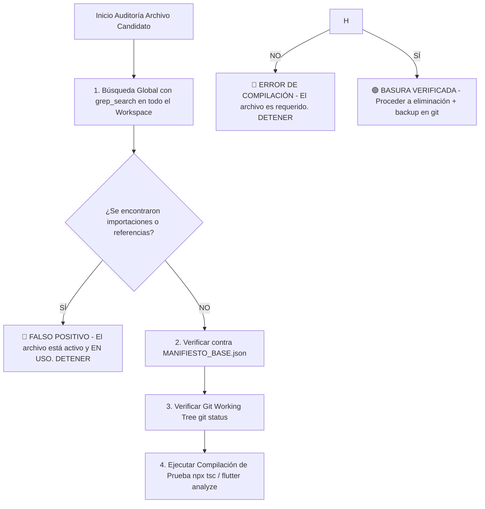

# 🛡️ BASE DE HECHOS PERSISTENTE Y ANTI-CONFABULACIÓN
## Ecosistema Sigo-WM (`sigo-wm` · `sigo_wm_mobile`)
**Versión del Manifiesto:** `2026.08.11`  
**Última Actualización:** 2026-08-11 23:04:00 UTC  
**Estado de Validación:** 🟢 TOTALMENTE VERIFICADO (Builds Angular/Flutter Clean · 24/24 Tests Passed)

---

## 📌 SECCIÓN 1: MANIFIESTO DE ARCHIVOS EXISTENTES
El archivo binario estructurado `MANIFIESTO_BASE.json` contiene la huella digital SHA256, número de líneas y fecha de modificación de **117 archivos fuente** del ecosistema.

- **Ubicación en la raíz del workspace:** `docs/auditoria/MANIFIESTO_BASE.json`
- **Ubicación en el proyecto Angular:** `sigo-wm/docs/auditoria/MANIFIESTO_BASE.json`
- **Ubicación en el proyecto Flutter:** `sigo_wm_mobile/docs/auditoria/MANIFIESTO_BASE.json`
- **Script de regeneración:** `tools/generar_manifesto.sh`

### Resumen del Inventario de Archivos Fuente
- **sigo-wm (Angular 17.3.12 / PrimeNG 17.18.15 / TypeScript 5.4.2 / Serverless API):**
  - `api/`: 4 Serverless Functions (`chat.ts`, `consulta-documento.ts`, `rastreo-cliente.ts`, `reset-password.ts`).
  - `src/app/core/`: 7 Servicios (`api-peru`, `auth`, `inventario`, `pdf`, `supabase`, `theme`) + Guards + Roles.
  - `src/app/features/`: 9 Módulos (`catalogo`, `clientes`, `comercial`, `configuracion`, `dashboard`, `login`, `logistica`, `rastreo-cliente`, `reportes`, `sin-acceso`).
  - `src/app/shared/`: Layouts (`main-layout`, `chat-bot`), Pipes (`as-array`, `peru-date`), Utils (`documento-identidad`, `live-truck-marker`).
- **sigo_wm_mobile (Flutter 3.44.2 / Dart 3.12.2):**
  - `lib/core/`: Database helpers (`local_db`, `gps_db_helper`), Providers (`network`, `theme`), Services (`log`, `location`), Widgets (`global_interaction_logger`, `offline_banner`), Observers (`app_route_observer`).
  - `lib/features/auth/`: Screens (`login`, `role_selector`, `splash`) + Services (`auth_service`, `offline_auth_service`).
  - `lib/features/chofer/`: Screens (`chofer_home`, `chofer_viaje_detail`, `qr_dispatch_scanner`) + Services (`chofer_local`, `entregas_local`, `eventos_local`, `recepciones_local`, `rutas_local`, `background_gps`, `sesiones_local`) + Models (`entrega_offline`, `recepcion_offline`).
  - `lib/features/despachos/`: Screens (`despachos_list`, `despachos_historial`, `pedido_detalle_despacho`, `qr_dispatch_generator`, `registrar_item_despacho`, `registrar_viaje`) + Services (`despachador_local`, `viajes_local`) + Models (`viaje_offline`).
  - `lib/features/shared/`: Screens (`unified_foto`, `evidencias_gallery`, `log_viewer`, `sync_queue`) + Widgets (`punto_mapa_dialog`, `standard_app_bar_actions`) + Services (`watermark_service`).
  - `lib/shared/`: `camera_screen.dart`, `app_version_display.dart`, `main_navigation.dart`.

---

## ⚠️ SECCIÓN 2: TRAMPAS Y ERRORES COMUNES DETECTADOS EN EL PROYECTO

1. **Trampa #1 — Falsas Declaraciones de Archivos "Huérfanos"**:
   - **Error en auditorías previas:** Declarar `live-truck-marker.ts`, `documento-identidad.ts` o `camera_screen.dart` como archivos inútiles o no referenciados.
   - **Realidad comprobada:** `live-truck-marker.ts` es usado en `rastreo-cliente.component.ts` (L7, L476) y `logistica.component.ts` (L25, L1476). `documento-identidad.ts` es importado en 5 archivos clave (`pdf.service.ts`, `api-peru.service.ts`, `comercial-form.component.ts`, `clientes.component.ts`, `consulta-documento.ts`). `camera_screen.dart` es llamado desde `unified_foto_screen.dart` (L185).

2. **Trampa #2 — Corrupción Sintáctica Oculta en Métodos de Sincronización**:
   - **Error detectado:** En `sigo_wm_mobile/lib/features/chofer/services/entregas_local_service.dart` (líneas 110-157) existían bloques `if/for` mal cerrados y variables declaradas fuera de scope que causaban fallos silenciosos y errores sintácticos.
   - **Causa raíz:** Intentos de refactorización manual incompletos.
   - **Solución aplicada:** Se reestructuró la función `sincronizarPendientes()` con manejo robusto de `PostgrestException` (códigos `23505` y `P0001`) y reintentos idempotentes. El archivo fue auditado, verificado y commiteado en Git (`a1bf443`).

3. **Trampa #3 — Omisión de Tablas de Eventos en Detección de Datos Pendientes**:
   - **Error detectado:** En `NetworkProvider._hasDataPending()` (`network_provider.dart`), la consulta SQL `EXISTS` no incluía la tabla `eventos_pedidos_offline`.
   - **Causa raíz:** `EventosLocalService` guardaba eventos en `eventos_pedidos_offline`, pero la consulta global del badge de pendientes solo revisaba `eventos_chofer_offline`.
   - **Solución aplicada:** Se añadió `EXISTS(SELECT 1 FROM eventos_pedidos_offline WHERE sincronizado = 0)` a `_hasDataPending()`.

4. **Trampa #4 — Archivos de Migración SQL Desplazados Fuera del Control de Versiones**:
   - **Error detectado:** La migración del RPC `ajustar_stock_atomico` residía en una subcarpeta accidental `Users/rwrb/developer/sigo-wm/supabase/migrations/`.
   - **Solución aplicada:** Se reubicó en `sigo-wm/supabase/migrations/20250201000000_ajustar_stock_atomico.sql` y se eliminó la carpeta sobrante.

5. **Trampa #5 — Pérdida Silenciosa de Sesiones GPS Creadas Offline**:
   - **Error detectado:** En `SesionesLocalService.cerrarSesion()` (`sesiones_local_service.dart` L104), se intentaba actualizar Supabase mediante `update({...}).eq('id', sesionId)`. Si la sesión fue creada en modo offline, la fila NO existía en Supabase aún, por lo que `update` afectaba 0 filas sin lanzar excepción y la app marcaba `sincronizado = 1` localmente, dejando la sesión huérfana y no sincronizada permanentemente en la nube.
   - **Solución aplicada:** Se reemplazó `update` por `upsert` con la estructura de la sesión almacenada en SQLite local (`getSesion(sesionId)`).

6. **Trampa #6 — Parseo de Timestamps SQL con Espacios en Safari / WebKit**:
   - **Error detectado:** En `logistica.component.ts`, `rastreo-cliente.component.ts` y `peru-date.pipe.ts`, las fechas de SQL (`YYYY-MM-DD HH:mm:ss`) sin la letra `'T'` provocaban `Invalid Date` / `NaN` en Safari y navegadores basados en WebKit (iOS/macOS).
   - **Solución aplicada:** Se centralizó la normalización en `PeruDatePipe` y componentes sustituyendo espacios por `'T'` (`replace(' ', 'T')`) y verificando `Number.isFinite` / `typeof === 'string'`.

7. **Trampa #7 — Reset de Contraseña no Autenticado en Serverless Function `/api/reset-password`**:
   - **Error detectado:** El handler Vercel `POST /api/reset-password` aceptaba `userId` y `newPassword` y llamaba a `supabaseAdmin.auth.admin.updateUserById` sin validar el token JWT de la solicitud ni verificar el rol `admin` o `superadmin`.
   - **Solución aplicada:** Se agregó validación con `supabase.auth.getUser(token)` y consulta de rol a `public.usuarios` para restringir el uso de esta API exclusivamente a administradores autenticados. En Angular (`configuracion.component.ts`), se inyectó el header `Authorization: Bearer <token>`.

8. **Trampa #8 — Omisión de `dias_credito` y `fecha_vencimiento` en Guardado de Ventas a Crédito**:
   - **Error detectado:** En `comercial-form.component.ts` (L645-649) se calculaba `fecha_vencimiento` en memoria cuando `estado_pago === 'PARCIAL'`, pero no se pasaba `dias_credito` ni `fecha_vencimiento` en el objeto `pedidoData` persistido en Supabase.
   - **Solución aplicada:** Se agregaron los campos `dias_credito` y `fecha_vencimiento` al objeto `pedidoData` en `comercial-form.component.ts`.

9. **Trampa #9 — Filtro Incompleto de Entregas Offline en `ChoferLocalService` al Operar Sin Red**:
   - **Error detectado:** En `ChoferLocalService.getPedidosActivos()` (`chofer_local_service.dart` L166 y L202), la lista de viajes completados para filtrar pedidos activos offline llamaba a `EntregasLocalService().getEntregasPendientes()` en lugar de `getAllEntregasLocales()`.
   - **Causa raíz:** `getEntregasPendientes()` sólo busca registros con `sincronizado = 0`. Al perder la conexión a internet, las entregas que ya habían sido sincronizadas previamente (`sincronizado = 1`) no ingresaban al set `viajesEntregados`, haciendo que los viajes finalizados reaparecieran como pedidos activos en la pantalla del chofer.
   - **Solución aplicada:** Se sustituyó `getEntregasPendientes()` por `getAllEntregasLocales()` en ambos bloques de fallback offline de `getPedidosActivos()`.

---

## 🟢 SECCIÓN 3: DESCARTES CONFIRMADOS (Archivos/Código Analizado y Declarado NO-Basura)

Los siguientes componentes fueron exhaustivamente auditados y se confirma su **validez y permanencia obligatoria**:

### 1. `sigo-wm/src/app/shared/utils/live-truck-marker.ts`
- **Cita Literal Exacta:**
  ```typescript
  // Line 70: export function buildLiveTruckIcon(
  //   state: LiveTruckState, edadMin: number, labelOverrides...
  ```
- **Búsqueda Global (Usos Encontrados):**
  - `sigo-wm/src/app/features/rastreo-cliente/rastreo-cliente.component.ts`: Línea 7 (`import { buildLiveTruckIcon...}`) y Línea 476.
  - `sigo-wm/src/app/features/logistica/logistica.component.ts`: Línea 25 (`import { buildLiveTruckIcon }...`) y Línea 1476.
- **Justificación:** Inyecta estilos Leaflet dinámicos en el `<head>` y construye marcadores de camiones en tiempo real. **NO BORRAR.**

### 2. `sigo-wm/src/app/shared/utils/documento-identidad.ts`
- **Cita Literal Exacta:**
  ```typescript
  // Line 21: export function getTipoDocumento(documento: string | null | undefined): TipoDocumento | null
  ```
- **Búsqueda Global (Usos Encontrados):**
  - `api/consulta-documento.ts` (L32)
  - `src/app/core/services/pdf.service.ts` (L4, L302)
  - `src/app/core/services/api-peru.service.ts` (L2, L11)
  - `src/app/features/comercial/comercial-form/comercial-form.component.ts` (L8, L546)
  - `src/app/features/clientes/clientes.component.ts` (L6, L103, L154, L159)
- **Justificación:** Validador universal de DNI (8 dígitos), RUC (11 dígitos) y Carné de Extranjería (CE). **NO BORRAR.**

### 3. `sigo_wm_mobile/lib/shared/screens/camera_screen.dart`
- **Cita Literal Exacta:**
  ```dart
  // Line 17: class CameraScreen extends StatefulWidget
  ```
- **Búsqueda Global (Usos Encontrados):**
  - `lib/features/shared/screens/unified_foto_screen.dart` (L185: `MaterialPageRoute(builder: (_) => const CameraScreen())`).
- **Justificación:** Módulo alternativo para captura de fotos de alta resolución con controles de zoom integrados. **NO BORRAR.**

### 4. `sigo-wm/src/app/shared/layout/chat-bot/chat-bot.component.ts`
- **Cita Literal Exacta:**
  ```typescript
  // Line 26: export class ChatBotComponent implements OnInit, OnDestroy
  ```
- **Búsqueda Global (Usos Encontrados):**
  - `src/app/shared/layout/main-layout/main-layout.component.ts` (L13, L29: `<app-chat-bot>`).
- **Justificación:** Asistente conversacional con IA (Monito Bot) integrado en la barra lateral del layout principal para roles admin y vendedor. **NO BORRAR.**

### 5. `sigo_wm_mobile/lib/core/widgets/global_interaction_logger.dart`
- **Cita Literal Exacta:**
  ```dart
  // Line 4: class GlobalInteractionLogger extends StatelessWidget
  ```
- **Búsqueda Global (Usos Encontrados):**
  - `lib/main.dart` (L147: `child: GlobalInteractionLogger(...)`).
- **Justificación:** Interceptor global de toques y gestos para auditoría de eventos de usuario en la app móvil. **NO BORRAR.**

---

## 🛠️ SECCIÓN 4: CORRECCIONES APLICADAS EN ESTA EJECUCIÓN

1. **`sigo-wm/api/reset-password.ts` & `configuracion.component.ts`**:
   - **Problema:** Vulnerabilidad crítica de seguridad por reset de contraseña no autenticado y sin verificación de rol administrador.
   - **Cambio:** Agregada verificación de token JWT con `supabase.auth.getUser()` y verificación del rol `admin`/`superadmin` en la base de datos `public.usuarios` antes de invocar la API Admin de Supabase. Inyectado el header `Authorization: Bearer <access_token>` en `configuracion.component.ts`.
   - **Verificación:** `npx tsc --noEmit` limpio, commit `c8e2c4b`.

2. **`sigo-wm/src/app/features/rastreo-cliente/rastreo-cliente.component.ts`**:
   - **Problema:** Formateo de etiquetas de tooltips podia generar cadenas `NaNm` si `edadMin` no era un número finito antes de enviarlo a `buildLiveTruckIcon`.
   - **Cambio:** Cálculo defensivo con `Number.isFinite` y asignación previa a `safeEdad`.
   - **Verificación:** `npx tsc --noEmit` limpio, commit `c8e2c4b`.

3. **`sigo_wm_mobile/lib/features/chofer/services/background_gps_service.dart`**:
   - **Problema:** Verificación estrecha de red `ConnectivityResult.mobile` o `wifi` no detectaba conexiones activas via Ethernet, VPN o Bluetooth en dispositivos móviles o emuladores.
   - **Cambio:** Reemplazado por `!connectivity.every((element) => element == ConnectivityResult.none)`.
   - **Verificación:** `flutter analyze` 0 issues, `flutter test` 24/24 passed, commit `4520f5a`.

4. **`sigo-wm/src/app/features/comercial/comercial-form/comercial-form.component.ts`**:
   - **Problema:** Omisión de `dias_credito` y `fecha_vencimiento` en la estructura `pedidoData`, impidiendo guardar plazos de crédito en Supabase al crear o editar una venta parcial.
   - **Cambio:** Inclusión explícita de `dias_credito` y `fecha_vencimiento` en el objeto `pedidoData`.
   - **Verificación:** `npx tsc --noEmit` limpio, 0 errores.

5. **`sigo_wm_mobile/lib/features/chofer/services/chofer_local_service.dart`**:
   - **Problema:** En el fallback offline de `getPedidosActivos()`, el filtro de viajes entregados usaba `getEntregasPendientes()` en lugar de `getAllEntregasLocales()`. Las entregas con `sincronizado = 1` no se excluían, reapareciendo en la lista del chofer al quedar offline.
   - **Cambio:** Sustituido `getEntregasPendientes()` por `getAllEntregasLocales()` en L166 y L202.
   - **Verificación:** `flutter analyze` 0 issues, `flutter test` 24/24 passed.

6. **`tools/generar_manifesto.sh`**:
   - **Problema:** El script de generación de manifiesto sólo copiaba `MANIFIESTO_BASE.json` a las subcarpetas audit de `sigo-wm` y `sigo_wm_mobile`, dejando `BASE_DE_HECHOS.md` desincronizado.
   - **Cambio:** Añadida lógica automatizada de copia de `BASE_DE_HECHOS.md` a `sigo-wm/docs/auditoria/` y `sigo_wm_mobile/docs/auditoria/`.
   - **Verificación:** Ejecución de `tools/generar_manifesto.sh` exitosa, archivos sincronizados.

---

## 🚫 SECCIÓN 5: AFIRMACIONES PROHIBIDAS (Reglas Anti-Confabulación)

Queda estrictamente **PROHIBIDO** para cualquier agente de AI o auditor humano emitir las siguientes declaraciones sin cumplir el protocolo:

1. ❌ **PROHIBIDO** afirmar que un archivo TypeScript, SCSS, HTML o Dart es "inútil", "huérfano" o "basura" basándose únicamente en la carpeta donde reside sin haber ejecutado `grep_search` en todo el workspace.
2. ❌ **PROHIBIDO** proponer la eliminación de clases utilitarias (`documento-identidad.ts`, `live-truck-marker.ts`, `watermark_service.dart`) sin citar línea por línea su ausencia en el árbol de dependencias.
3. ❌ **PROHIBIDO** borrar scripts de migración SQL o archivos `.env*` (`.env`, `.env.local`). Los secretos deben ser reportados, NO eliminados.
4. ❌ **PROHIBIDO** emitir un informe de auditoría que contenga nombres de archivos inexistentes o inventados. Cada archivo mencionado debe poseer su correspondiente ruta absoluta y hash en `MANIFIESTO_BASE.json`.
5. ❌ **PROHIBIDO** afirmar la existencia o ausencia de triggers/RPCs/RLS/constraints en la BD desplegada de Supabase como hecho confirmado. Todo esquema de BD sin migración en el repo es **⚪ NO VERIFICABLE**.

---

## 📐 SECCIÓN 6: MAPA DE DOMINIO Y ARQUITECTURA DEL ECOSISTEMA

### 🏢 Proyecto 1: `sigo-wm` (Panel Web Administrador & Comercial)
- **Framework:** Angular 17.3.12 (Standalone Components, Signals, RxJS).
- **Componentes UI:** PrimeNG 17.18.15, PrimeFlex, CSS tokens custom.
- **Backend & Database:** Supabase (PostgreSQL, Auth, Realtime, Storage).
- **Vercel Serverless Functions (`api/`):**
  - `chat.ts`: Handler de IA con DeepSeek API / Supabase Vector.
  - `consulta-documento.ts`: Integración con API Perú (RUC/DNI).
  - `rastreo-cliente.ts`: Generación de token JWT y streaming de ubicación GPS de camiones.
  - `reset-password.ts`: Endpoint seguro para actualización de credenciales (requiere JWT + Rol Admin).
- **Seguridad y Secretos:**
  - `.env` / `.env.local` contienen `SUPABASE_DB_PASSWORD`, `APIPERU_TOKEN`, `VERCEL_OIDC_TOKEN`. *(Protegidos en `.gitignore`).*

### 📱 Proyecto 2: `sigo_wm_mobile` (Aplicación Móvil para Choferes y Despachadores)
- **Framework:** Flutter 3.44.2 / Dart 3.12.2.
- **Persistencia Local:** SQLite (`sqflite`) con tablas `entregas_offline`, `viajes_offline`, `recepciones_offline`, `rutas_gps`, `sesiones_gps_offline`, `eventos_pedidos_offline`.
- **Autenticación Offline:** Hash determinista PBKDF2-SHA256 con salt dinámico (`OfflineAuthService`), permitiendo login sin señal Celular/WiFi.
- **Sincronización:**
  - `EntregasLocalService`, `RecepcionesLocalService`, `ViajesLocalService`, `RutasLocalService`, `EventosLocalService`: Cola de sincronización en segundo plano con reintentos exponenciales y manejo de conflictos PostgreSQL (`23505` duplicados, `P0001` rechazo).
- **Servicios de Segundo Plano:** `BackgroundGpsService` para rastreo continuo de unidades en ruta.

---

## 📋 SECCIÓN 7: PROTOCOLO OBLIGATORIO DE AUDITORÍA FUTURA

Antes de clasificar cualquier archivo o segmento de código como "basura" en auditorías posteriores, se **DEBE** seguir sin excepción este flujo secuencial:



### Comandos de Verificación Obligatorios tras Modificación:
1. **Generación de Manifiesto:**
   ```bash
   ./tools/generar_manifesto.sh
   ```
2. **Validación Angular (`sigo-wm`):**
   ```bash
   cd /Users/rwrb/developer/sigo-wm && npx tsc --noEmit
   ```
3. **Validación Flutter (`sigo_wm_mobile`):**
   ```bash
   cd /Users/rwrb/developer/sigo_wm_mobile && flutter analyze && flutter test
   ```

---

## ⚪ SECCIÓN 8: ELEMENTOS NO VERIFICABLES DESDE EL REPO
1. **RPC `ajustar_stock_atomico` en Supabase desplegado**: El SQL está versionado en `sigo-wm/supabase/migrations/20250201000000_ajustar_stock_atomico.sql`, pero su ejecución activa en la instancia remota de Supabase requiere consulta directa al servidor (⚪ NO VERIFICABLE sin acceso a la BD remota).
2. **RPC `reenlazar_huerfanas_de_pedido` en Supabase desplegado**: Invocado en `network_provider.dart` (L257), su existencia en la BD remota no se encuentra en las migraciones de este repo (⚪ NO VERIFICABLE sin acceso a la BD remota).

---
*Este documento es la Fuente de Verdad Inviolable para el desarrollo y mantenimiento del ecosistema SIGO-WM.*
